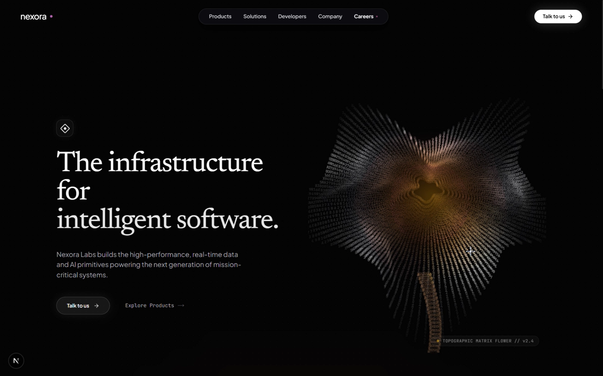
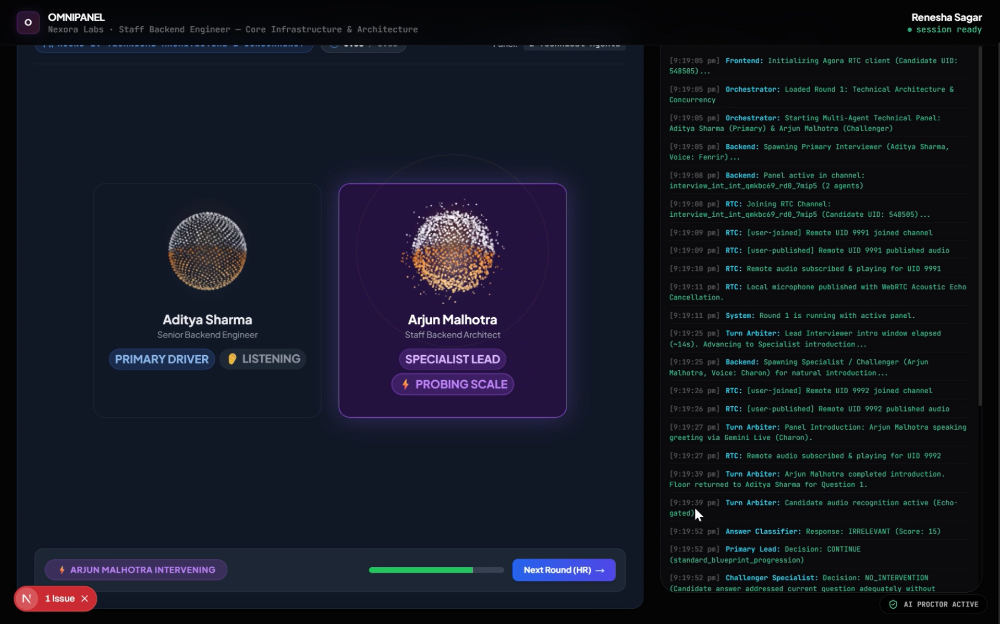
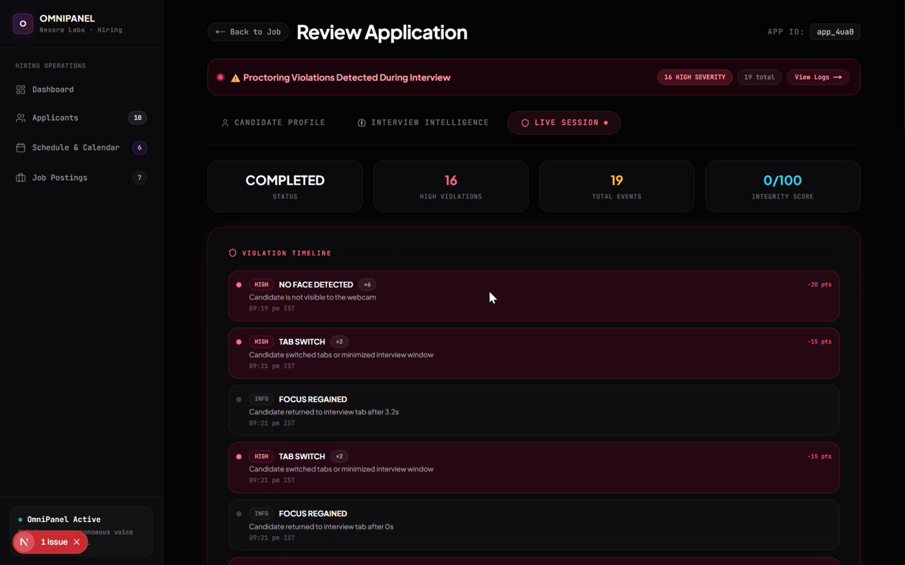
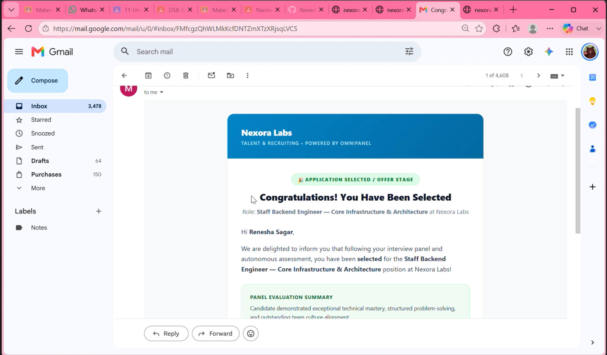

<div align="center">

# 🎙️ EchoSphere — Autonomous AI Hiring Platform

**Built for the Agora Hackathon**

[](https://nextjs.org)
[](https://www.typescriptlang.org)
[](https://www.agora.io)
[](https://ai.google.dev)
[](https://mediapipe.dev)

*A dynamic multi-agent AI interview panel. One Agora channel. Zero scheduling headaches.*

</div>

---

## The Problem

First-round technical interviews are broken:

- Senior engineers waste 30–50 hours/month screening candidates who don't meet the bar
- Evaluation quality is inconsistent — it depends on who happens to be free that day
- Candidates cheat with AI assistants while the interviewer has no visibility
- Resume review is disconnected from GitHub reality and LinkedIn claims

**EchoSphere replaces the entire first-round interview panel with a dynamic multi-agent AI system** — Priya (Lead Interviewer) and Arjun (Technical Challenger) — who conduct structured, personalized, real-time voice interviews over **Agora WebRTC**, then deliver a transcript-grounded evidence scorecard to the human hiring committee.

---

## Screenshots

### Landing Page


### Dynamic Multi-Agent Live Interview Room (Agora + Gemini Live)


### Admin Panel — Application Review & Scorecard


### Automated Candidate Emails


---

## Agora at the Core

> EchoSphere is built around Agora as its real-time communication backbone. Every interaction in the live interview — audio transport, dynamic multi-agent turn coordination, low-latency voice delivery — runs through Agora's infrastructure.

### How We Use Agora

#### 1. Real-Time Multi-Agent Audio Transport
Each live interview session opens a dedicated **Agora RTC channel** where all AI agents and the candidate participate as audio publishers/subscribers:

- The candidate's microphone is published as a live audio stream in the Agora channel
- Each AI agent's synthesized voice is streamed back to the candidate through the same Agora channel
- **Agora handles all WebRTC complexity** — STUN/TURN negotiation, adaptive bitrate, packet recovery — so we focus entirely on the AI and interview logic

```
Candidate Mic → Agora RTC Channel ← AI Agent Voice (Priya / Arjun)
```

#### 2. Agora + Gemini Live: No Cascading Pipeline
Traditional voice AI stacks look like this:

```
Candidate Audio → Speech-to-Text → LLM → Text-to-Speech → Candidate Ear
                  (500ms)          (800ms)  (500ms)
                  ════════════ ~2,000ms total latency ════════════
```

We eliminated this entirely. EchoSphere connects **Gemini 2.0 Multimodal Live** directly over Agora WebRTC:

```
Candidate Audio → Agora → Gemini Live MLLM → Agora → Candidate Ear
                  ════════════ <500ms total latency ════════════
```

Gemini Live processes audio natively — no transcription step, no TTS roundtrip. The result is natural, conversational, human-paced dialogue with zero perceptible lag.

#### 3. Dynamic Multi-Agent Architecture Over a Single Channel
The multi-agent panel shares the **same Agora channel** but each agent runs as an independent Gemini Live session, with its own system prompt, persona, voice, and conversation context:
Lets take an example :
| Agent | Voice | Agora Role | Persona |
|---|---|---|---|
| **Priya Sharma** | `Aoede` | Publisher (primary) | Lead interviewer — structured, warm, covers architecture & behavioral |
| **Arjun Mehta** | `Charon` | Publisher (challenger) | Technical deep-diver — analytical, probes implementation details |

A **Turn Arbiter** (floor request state machine in `lib/interview/interviewState.ts`) coordinates the dynamic multi-agent panel so only one agent speaks at a time:
- When Priya is speaking, Arjun's floor requests are queued
- Arjun raises a `FloorRequest` when the candidate mentions a specific technology (Kafka, Raft, Redis, WebRTC, concurrency patterns, etc.)
- If the candidate addresses Arjun by name directly, he gets the floor immediately
- A mutual-exclusion concurrency lock prevents audio overlap inside the Agora channel

#### 4. Token-Authenticated Channels
Every interview session generates Agora RTC tokens server-side using `agora-token`, scoped to the specific interview channel with time-bounded expiry. The candidate joins with a unique UID and the AI agents join as separate publisher UIDs.

#### 5. Audio Level Monitoring
`lib/agora.ts` continuously monitors audio levels of all participants in the Agora channel, used to detect if the candidate's mic is silent for an extended period — a potential disengagement flag surfaced in the proctoring integrity report.

---

## System Architecture

```
┌─────────────────────────────────────────────────────────────────────────────┐
│                           ECHOSPHERE PLATFORM                               │
│                                                                             │
│  ┌──────────────┐    ┌───────────────────────────────────────────────────┐  │
│  │   CANDIDATE  │    │              AGORA RTC CHANNEL                   │  │
│  │              │    │                                                   │  │
│  │  Browser Mic ├───►│  Audio Stream ──► Gemini Live MLLM (Priya)      │  │
│  │              │◄───┤  AI Voice     ◄── Gemini Live MLLM (Arjun)      │  │
│  │  MediaPipe   │    │                                                   │  │
│  │  (Proctor)   │    │    Dynamic Multi-Agent Turn Arbiter / Floor Lock │  │
│  └──────────────┘    └───────────────────────────────────────────────────┘  │
│                                                                             │
│  ┌─────────────────────────────────────────────────────────────────────┐   │
│  │                     ADMIN DASHBOARD                                  │   │
│  │                                                                      │   │
│  │  Application Review → Scorecard → Proctoring Audit → Hire/Reject   │   │
│  └─────────────────────────────────────────────────────────────────────┘   │
└─────────────────────────────────────────────────────────────────────────────┘
```

### Full Platform Flow

```
1. APPLY          → Candidate submits resume + GitHub + LinkedIn
                    ↓ Instant confirmation (<100ms)
                    ↓ Background: PDF parse, GitHub ingest, LinkedIn enrich, LLM correlation

2. ADMIN REVIEW   → Recruiter sees enriched profile, verified skills, GitHub stats
                    ↓ Clicks "Select for Interview" → status: SHORTLISTED
                    ↓ Schedule interview → Gemini generates personalized blueprint

3. LIVE INTERVIEW → Candidate joins Agora channel
                    ↓ Dynamic multi-agent panel begins (Priya leads, Arjun challenges)
                    ↓ Turn Arbiter coordinates agents in real time over Agora
                    ↓ MediaPipe proctoring runs in-browser at 30fps
                    ↓ Transcript is saved turn-by-turn

4. SCORECARD      → Gemini evaluates full transcript against rubric
                    ↓ Outputs: verdict, per-pillar scores, evidence quotes, MoM

5. DECISION       → Human recruiter reviews scorecard in admin dashboard
                    ↓ Clicks Hire / Reject → automated offer/rejection email
```

---

## Features

### 🎙️ Dynamic Multi-Agent Live Interview Room
- Agora WebRTC channel for real-time bidirectional audio between candidate and AI panel
- Multiple independent Gemini Live agents with distinct voices, personas, and system prompts — all sharing one Agora channel
- Dynamic Floor Arbiter prevents audio overlap — natural conversational dynamics emerge organically
- Personalized questions generated from candidate's actual GitHub repos, resume claims, and LinkedIn history
- Turn-by-turn transcript saved to database for post-interview evaluation

### 🛡️ Browser-Side Anti-Cheating (MediaPipe)
Zero server cost. Zero video egress. All processing on the candidate's machine via WebAssembly + WebGL.

| Detection | Severity | Method |
|---|---|---|
| No face visible | HIGH | FaceLandmarker presence check |
| Multiple people | HIGH | Face count > 1 |
| Looking away (gaze) | MEDIUM | 3D eye blendshapes + head yaw/pitch |
| Tab switch / window blur | HIGH | `visibilitychange` + `blur` events |
| Heavy typing during speech | MEDIUM | Keystroke frequency monitor |
| Clipboard paste | MEDIUM | `paste` event listener |

Candidate sees only a subtle **"AI Proctor Active"** badge — no intimidating counters or alerts.

### 📊 Admin Dashboard
- **Candidate Profile tab**: Identity, LinkedIn narrative, GitHub stats + repos, resume extraction, cross-source corroborated skills
- **Interview Intelligence tab**: Full scorecard with radar chart, verified strengths, growth areas, competency rubric with verbatim evidence quotes, Executive MoM, agent briefing directives
- **Live Session tab**: Proctoring violation timeline, integrity score, deduped events (shown as `EVENT ×N`)

### 📋 Post-Interview Report (Candidate-Facing)
Available at `/report/[sessionId]`:
- Overall verdict badge (Strong Hire / Hire / No Hire)
- Radar chart across all competency rubric pillars
- Key verified strengths and growth areas
- Executive recruiter minutes of meeting with interviewer-observed quotes
- Detailed competency breakdown with evidence

### ✉️ Automated Email Pipeline

| Event | Email Sent |
|---|---|
| Application received | Confirmation with next steps |
| Extraction failed | Failure details + what to fix |
| Selected for interview | Invitation with Agora room link + scheduled time |
| Rejected | Polite rejection with feedback |
| Job offered | Offer letter with compensation next steps |

Dual transport: **Resend** (primary) → **Gmail SMTP via Nodemailer** (zero-domain fallback).

---

## Tech Stack

| Layer | Technology |
|---|---|
| Framework | Next.js 16, React 19, TypeScript |
| Real-Time Audio | **Agora RTC SDK** (`agora-rtc-sdk-ng`) |
| Dynamic Multi-Agent AI | **Google Gemini 2.0 Flash Multimodal Live** |
| AI Evaluation | Google Gemini (generative AI SDK) |
| Computer Vision | **Google MediaPipe** FaceLandmarker |
| Styling | Tailwind CSS, Framer Motion |
| Charts | Recharts (RadarChart) |
| PDF Parsing | `pdf-parse` |
| LinkedIn Enrichment | Bright Data Web Scraper API |
| Email | Resend + Nodemailer (Gmail SMTP) |
| Database | JSON flat-file via `lib/db.ts` |
| Icons | Lucide React |

---

## Project Structure

```
echosphere/
├── photos/
│   ├── landing.png               # Landing page
│   ├── mllm_agent.png            # Live multi-agent interview room
│   ├── admin_panel.png           # Admin dashboard + scorecard
│   └── email.png                 # Automated candidate emails
├── frontend/
│   ├── app/
│   │   ├── admin/
│   │   │   ├── applications/[id]/
│   │   │   │   ├── page.tsx              # Server component — fetches data
│   │   │   │   ├── ApplicationTabView.tsx # 3-tab client component
│   │   │   │   ├── ScorecardViewer.tsx   # Radar chart, rubric, evidence quotes
│   │   │   │   └── ApplicationActions.tsx # Hire / Reject / Shortlist buttons
│   │   │   ├── jobs/[id]/               # Job detail + pipeline Kanban
│   │   │   └── schedule/                # Interview scheduling + blueprint generation
│   │   ├── api/
│   │   │   ├── agora-mllm/              # Agora token generation + Gemini Live session start
│   │   │   ├── applications/[id]/       # PATCH status, email triggers
│   │   │   ├── interviews/[id]/
│   │   │   │   ├── blueprint/           # AI blueprint generation (Gemini)
│   │   │   │   ├── evaluate-final/      # Full scorecard generation
│   │   │   │   ├── evaluate-round/      # Per-round mini-evaluation
│   │   │   │   ├── proctor/             # Save + fetch proctoring events
│   │   │   │   ├── report/              # Report data for report page
│   │   │   │   └── state/               # Live interview state
│   │   │   ├── jobs/[id]/apply/         # Instant submission + async pipeline
│   │   │   └── orchestrator/            # Turn arbiter + floor request handling
│   │   ├── interview/[blueprintId]/
│   │   │   ├── InterviewRoom.tsx        # Agora channel + dynamic multi-agent Gemini Live
│   │   │   ├── ProctorEngine.tsx        # MediaPipe FaceLandmarker (30fps)
│   │   │   └── InterviewLobbyWrapper.tsx
│   │   ├── jobs/[id]/apply/             # Candidate application form
│   │   └── report/[sessionId]/          # Post-interview report
│   ├── lib/
│   │   ├── agora.ts                     # Agora RTC client, mic track, audio monitoring
│   │   ├── db.ts                        # JSON flat-file database
│   │   ├── email/                       # Email templates (Resend + Nodemailer)
│   │   ├── enrichment/
│   │   │   ├── github.ts                # GitHub REST API ingestion
│   │   │   ├── linkedin.ts              # Bright Data LinkedIn scraper
│   │   │   ├── extract.ts               # PDF + Google Drive resume parser
│   │   │   └── correlation.ts           # Cross-source LLM skill corroboration
│   │   └── interview/
│   │       ├── interviewState.ts        # Turn arbiter, FloorRequest, concurrency lock
│   │       └── interviewerPool.ts       # Agent persona definitions
│   ├── data.json                        # Flat-file database
│   └── .env.local                       # Environment variables
└── README.md
```

---

## Getting Started

### Prerequisites
- Node.js 20+
- An [Agora account](https://console.agora.io) with an App ID and App Certificate
- A [Google AI Studio](https://aistudio.google.com) API key (Gemini)

### Install

```bash
cd frontend
npm install --legacy-peer-deps
```

> **Note:** `--legacy-peer-deps` is required due to a peer dependency conflict between `next-themes` and React 19.

### Environment Variables

Create `frontend/.env.local`:

```env
# ── Agora WebRTC ─────────────────────────────────────────────────────────────
NEXT_PUBLIC_AGORA_APP_ID=your_agora_app_id
AGORA_APP_ID=your_agora_app_id
AGORA_APP_CERTIFICATE=your_agora_app_certificate
AGORA_CUSTOMER_ID=your_agora_customer_id

# ── Google Gemini ─────────────────────────────────────────────────────────────
GEMINI_API_KEY=your_gemini_api_key

# ── Email: Resend (primary) ───────────────────────────────────────────────────
RESEND_API_KEY=your_resend_api_key
RESEND_FROM_EMAIL=noreply@yourdomain.com

# ── Email: Gmail SMTP (fallback, no domain needed) ───────────────────────────
GMAIL_USER=your_gmail@gmail.com
GMAIL_APP_PASSWORD=your_gmail_app_password

# ── LinkedIn Enrichment: Bright Data (optional) ───────────────────────────────
BRIGHTDATA_API_KEY=your_brightdata_key
BRIGHTDATA_DATASET_ID=gd_l1viktl72bvl7bjuj0
MOCK_LINKEDIN_ENRICHMENT=true      # set false to make live API calls

# ── GitHub ────────────────────────────────────────────────────────────────────
GITHUB_TOKEN=your_github_pat       # optional, increases rate limit
MOCK_GITHUB_ENRICHMENT=false

# ── App ───────────────────────────────────────────────────────────────────────
FRONTEND_URL=http://localhost:3000
```

### Run

```bash
cd frontend
npm run dev
```

App is at **http://localhost:3000**

---

## Key Routes

| URL | Description |
|---|---|
| `/jobs` | Public job listings |
| `/jobs/[id]/apply` | Candidate application form |
| `/interview/[blueprintId]` | **Live Agora multi-agent interview room** |
| `/report/[sessionId]` | Post-interview candidate report |
| `/admin` | Admin dashboard home |
| `/admin/jobs/[id]` | Job detail + applicant pipeline |
| `/admin/applications/[id]` | Full application review + scorecard |
| `/admin/schedule` | Schedule interviews + generate blueprints |

---

## Engineering Decisions

### Why native Gemini Live over Agora instead of a cascading pipeline?
Cascading (`ASR → LLM → TTS`) introduces ~2,000ms of latency per turn — enough to make the conversation feel robotic. By connecting Gemini 2.0 Multimodal Live directly to the Agora channel, audio goes in and synthesized voice comes back in under 500ms. The multi-agent interview feels like talking to real people.

### Why multiple independent Gemini Live sessions sharing one Agora channel?
Each agent in the dynamic multi-agent panel needs its own system prompt, persona, and conversation context. Independent WebSocket sessions to Gemini Live — one per agent — publish to the same Agora channel. The Turn Arbiter manages who has the floor at any given moment, preventing audio overlap. This architecture makes the panel infinitely extensible: add more specialist agents (e.g. a domain-specific AI for ML or security roles) by simply adding another session to the pool.

### Why MediaPipe in the browser instead of sending video to a backend?
Streaming 30fps video from hundreds of concurrent interview sessions to GPU instances would cost thousands of dollars in compute and egress. MediaPipe runs entirely in the candidate's browser using WebAssembly + WebGL — it costs **$0** in server resources, has zero video egress latency, and guarantees that no raw biometric footage ever leaves the candidate's device.

### Why JSON flat-file instead of a traditional database?
For a hackathon prototype, `data.json` with `lib/db.ts` provides instant setup with no database provisioning, no migrations, and full read/write in a single file. Production would swap this for Postgres with Prisma (already included as a dev dependency).

### Human authority is non-negotiable
The dynamic multi-agent AI panel provides scores, evidence, and recommendations. It never sends a hire or rejection email automatically. Every outcome email is triggered by a human admin clicking a button. The platform augments the recruiter — it doesn't replace them.

---

## Data Model

`data.json` stores all application state:

```
candidates[]       → name, email, linkedinUrl, githubUrl
jobs[]             → title, description, requirements, salary
applications[]     → candidateId, jobId, status, resumeText,
                     candidateContext (enriched), evaluationScore
interviews[]       → applicationId, status, transcript[],
                     suspiciousEvents[], scorecard, proctoringReport
blueprints[]       → interviewId, blueprintJson (full agent briefing + rubric)
```

---

<div align="center">

Built with ❤️ using **Agora WebRTC** · **Google Gemini Live** · **MediaPipe** · **Next.js**

*EchoSphere — Agora Hackathon 2025*

</div>
